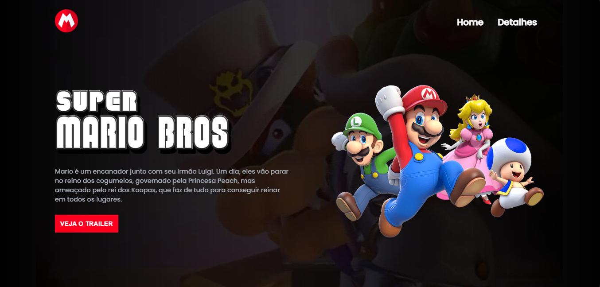

<h1 align="center">Projeto Super Mario Bros</h1>

<h1 align="center">
  
</h1>

### 🛠 Tecnologias

As seguintes ferramentas foram usadas na construção do projeto:

- [HTML](https://www.w3schools.com/html/default.asp)
- [CSS](https://www.w3schools.com/css/css_intro.asp)
- [JavaScript](https://www.w3schools.com/js/default.asp)

Um projeto frontend que mostra um site criado com prévias do filme do Super Mario usando <strong>HTML,CSS e Javascript.</strong>

Contando também com um design responsivo para demais tamanhos de tela e uma breve descrição do filme.
 
